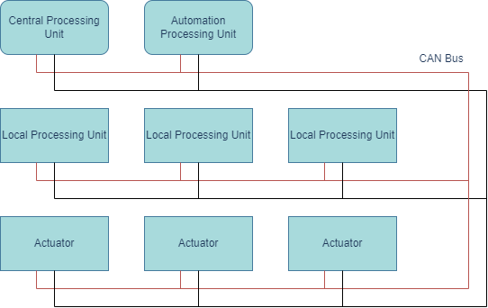

# Telemetry With Arduino And CAN Protocol

## Motivation
### Problem
This project proposed a model for an adaptive telemetry system which was implemented in a student's group of electric & smart vehicle engineering, as a solution for an integrated communication system that should be:

- Scalable;
- Robust;
- Flexible;
- Accessible to mount;
- Easy to learn.

The system should be able to use Local Processing Units as to collect raw data and send processed data from any generic type of sensor, be controlled by a Central Processing Unit (which would communicate with the cloud), without restrictions as to the type of data of the sensor. It should be capable to use this data, intermediated by Actuator Units, as to execute any desired application of it. An Automation Unit would be able to change state of the system that gave control over the Actuators either by user's direct control or directly by the values of the processed data. Criptograpy of the data would be supported.

### Solution
In order to create the system, a series of "template" codes were made to serve as a skeleton for implementing individual units. That is, they form the basis for the continuous development of specific components in the project and are designed in a generalistic manner. The idea would be to just copy these templates and modify minimal aspects of it in order to implement their basic functionalities with the desired application. The files here presented contains the code templates for the Central Unit, Local Processing Unit, Automation Unit and Actuators. I chose to use the Arduino microcontroller as the basic component for such functionalities (more specifically, the Arduino Nano, which is smaller), and the CAN (Controller Area Network) communication protocol to connect all individual modules. The Central Processing Unit template was created using a Beaglebone Black microcomputer. 

    

## System's Description

### Identifying each Unit With Hexadecimal References
Each individual Local Unit is uniquely identified by a hexadecimal value within the CAN Protocol, which determines the priority of each message in communication. However, each sensor is also uniquely identified since there may be more than one sensor for a single unit. This identifier is editable in the start of the template code for Arduinos. The “0xXXY” convention identifier allows representation of 4096 different values, and is described as follows:
1. Central Processing messages have “0x000” indicators, and its content in bytes is associated with specific messages, which are:
    - "0.0" - error: Completely restarts the system.
    - "1.0" - connection: Request connection from all Local Processing Units.
    - "2.0" - processing: End of Local Processing Unit request mode.
2. Automation Processing has an identifier “0x001”, and serves to standardize communication with the actuators, in addition to sending the following standardized messages:
    - "3.0" - automatic: enables automation mode.
    - "4.0" - manual: disables automation mode.
3. XX: Associated Processing number. Thus, we can represent 255 Local Processing Units (XX = 00 is reserved).
4. Y: Sensor number associated with Local Processing. This way we can represent 16 sensors per Local Unit.
5. Example: “0x103” means the identifier of a message from the 4th sensor of the 15th Local Processing.

### Execution Flow In The Vehicle
1. Energization of all units when activating the general energy switch, beginning the execution of programs simultaneously.
2. Local Processing Units go into stall mode until they receive the Central Processing's "connection" message.
3. Central Processing Unit sends the "connection" message, requesting the identification data associated with the sensors of all Local Processing Units.
4. All Local Processing Units send information from each sensor, encoded in a string, and then goes into stall mode until the "processing" message is sent by Central Processing. As the CAN protocol limits the number of bytes sent per message, every string is encoded into a sequence of bytes and decoded by the Central Processing with the help of special characters included in the messages associated with the string. Each sensor is associated with the following information (those not related to hardware are stored in a data structure in Central Processing to generate a log):
    - Sensor Name;
    - Unit of measurement;
    - Collection step (whithin how many seconds the data is collected);
    - Pin (where it is connected to the Arduino);
    - Maximum value (if not null, it says the maximum value that the measurement can reach before identifying a value alert);
    - Minimum value (if not null, it says the minimum value that the measurement can reach before identifying a value alert).
5. After a certain period of time without receiving information from Local Processing, the Central Processing sends the "processing" message, requesting sensor readings.
6. With the collection of values from each sensor occurring at the frequency determined in its sensor information (predetermined), the Local Processing Units interpret sends messages to the CAN protocol with their associated reading, every time the time elapsed since the last collection of values is the same as it's step. Considering that the messages sent by Local Processing are not processed immediately through Central Processing, a lag is prevented from occurring incremental in writing data on a continuous temporal scale. The code was formulated so that the delay between the step is equal to the elapsed time since the last reading and the reading of the value in Local Processing will be irrelevant.
7. Central Processing interprets incoming sensor data, sends it to the external communication protocol, and generates a log formatted on the SD card module.
8. At any time, if the data received by Central Processing is not formatted properly, it will send the "error" message, causing the Local Processing Units to completely restart, as if they had just been energized.

### Data Transmission Pipeline Via CAN Protocol
Every reading can be encoded in a float value “...abc.def...” - even Enum or Boolean values, which can be converted to integers (0.0, 1.0, ...). These measurements need to be encoded in Local Processing to be transmitted on CAN and recoded in Central Processing, according to the following order:
1. Measurement of float value in Local Processing;
2. Conversion of the float value into a string;
3. Final string concatenation with a special character (“;”), indicating end of string, in Local Processing;
4. String encryption in Local Processing;
5. Ordered division of the final string into lists of 8 characters in Local Processing (the CAN protocol only sends Strings of 8 bytes);
6. Ordered sending of character lists in the CAN protocol;
7. Reception of character lists in Central Processing and concatenation in full string (ending in the special character);
8. Applying the encryption key to find the original string in the Central Processing;
9. Converting the string to float in Central Processing, obtaining the measurement original and finishing the process.

## Getting Started
In order to apply CAN communications in the system, I used the Arduino module MCP2515, and the [arduino-mcp2515 library](https://github.com/autowp/arduino-mcp2515/tree/master). Other libraries are standard in the Arduino and Beaglebone Black. The following image presents the expected wiring between the Arduino Nano and the MCP2515:

    

Next up, for a practical implementation of each Unit in the vehicle, outside integrating all nodes with CAN communications, the templates should be applied according to the following instructions:

- Central Processing Unit: must have access to external communications, and send all transcribed data from the CAN bus into the cloud.
- Automation Unit: positioned somewhere the driver could access it's "change of automation state" button.
- Local Processing Units: Directly connected with the sensors related to this unit's implementation.
- Actuator Units: Directly connected with the actuators related to this unit's implementation.

### Applying templates
The template codes should be copied, pasted and edited for upload in the processing modules, and the updatable secions are directly indicated in the commented sections of each template. 
The main sections for substitution in the templates are:
- External connections in the Central Processing Unit (cloud, radio, SD card, ...);
- Hexadecimal values for each Local processing;
- Description of the sensor's parameters when debuting the system;
- Reading and conversion functions for each sensor;
- Actuator functions, given the measures, for each actuator.
Certain templates have an equivalent version with Serial I/O, adapted for debugging purposes when the programmer would like to test the functionalities without implementing them in the system.

### In The Original Project
The Local Processing Units were used to collect all type of sensory data, such as data from velocimeters, strain gauges, termometers, accelerometers, voltages, currents, pluviometric, luminosity, etc. 

The Central Processing Unit was integrated with a GPS module and radio communications, saving data in a SD card and also sending it to a computer outside the vehicle.

The Automation Unit was integrated with a LCD display for visualization of important vehicle data, and placed in the steering wheel of the driver. 

The Actuator Units were used to control subsystems automatically with the readings of sensors and without the driver's intervention, such as:
- Activating the windshield wipers whenever the pluviometric sensors detected that it started raining;
- Activating the vehicle's headlights whenever the luminosity sensors detected that it was dark.

The proposed encryption was a bit-by-by encryption with a long keyword.
